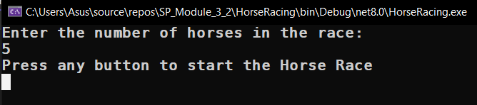
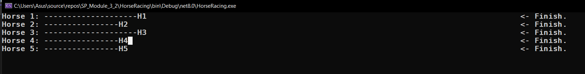
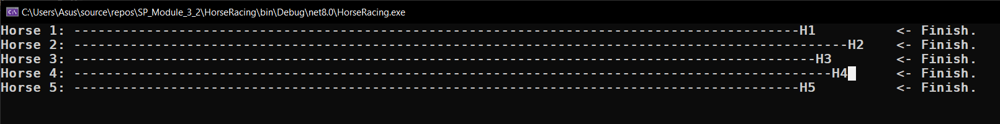
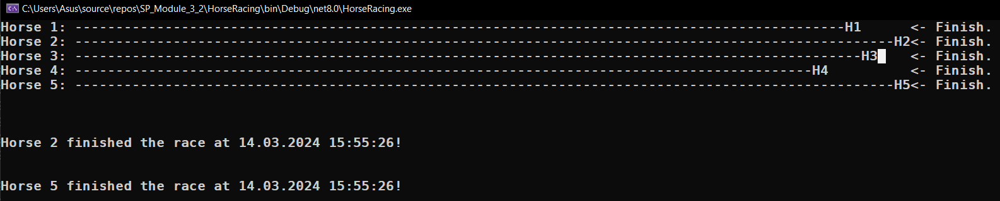
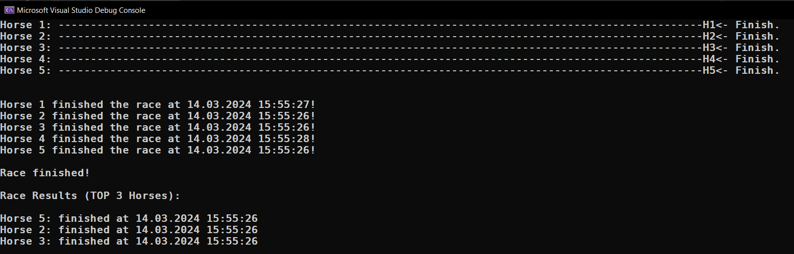
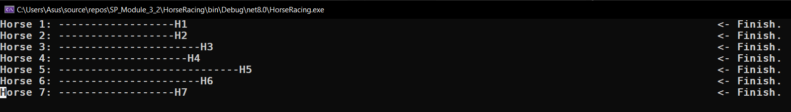
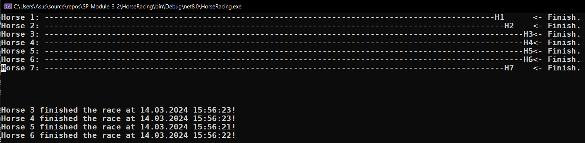
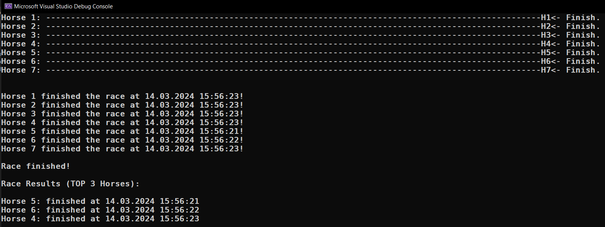
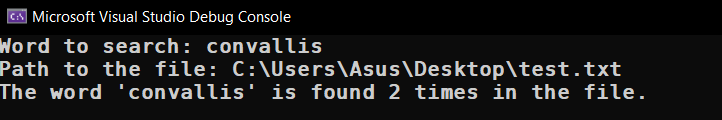

# Module 3_2

### Projects:

- [Horse Racing](#horse-racing)
- [Find Word In File Async](#find-word-in-file-async)

## Horse Racing

- [Program.cs](HorseRacing/Program.cs)
- [Horse.cs](HorseRacing/Horse.cs)

### You can enter the number of horses you want:

### 5 Horses:

### 7 Horses:

## Find Word In File Async

- [Program.cs](FindWordInFileAsync/Program.cs)
- [test.txt](FindWordInFileAsync/test.txt)

